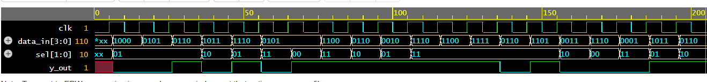

# Functional Verification of a 4:1 Multiplexer using SystemVerilog

A layered SystemVerilog verification environment developed to functionally verify a **4:1 Multiplexer (MUX)**. The project demonstrates the use of modern verification components including a **Generator, Driver, Monitor, Scoreboard, Interface, and Assertions** to validate DUT functionality.

---

# Project Overview

Functional verification ensures that a hardware design behaves according to its specification before fabrication or FPGA implementation.

This project verifies a 4:1 Multiplexer using a modular SystemVerilog testbench architecture. The verification environment generates stimulus, drives inputs to the DUT, monitors outputs, performs automatic result checking, and validates functionality through assertions.

---

# Project Contribution

This repository represents my implementation of the verification environment, including:

- Development of the SystemVerilog verification architecture
- RTL verification of the 4:1 Multiplexer
- Generator, Driver, Monitor, Interface, and Scoreboard implementation
- Assertion-based verification
- Functional simulation and waveform analysis

---

# Device Under Test (DUT)

The DUT is a **4:1 Multiplexer** implemented in SystemVerilog.

Its function is to select one of four input signals based on the select lines and route it to the output.

---

# Verification Environment

The verification environment consists of:

- Interface
- Generator
- Driver
- Monitor
- Scoreboard
- Assertions
- Top Testbench

Each verification component performs an independent task, resulting in a modular and reusable verification architecture.

---

# Verification Flow

The verification process follows the sequence:

Generator

↓

Driver

↓

Device Under Test (DUT)

↓

Monitor

↓

Scoreboard

↓

Assertions

---

# Repository Structure

```
systemverilog-4to1-mux-verification
│
├── rtl/
├── verification/
├── testbench/
├── images/
├── README.md
└── LICENSE
```

---

# Tools Used

- SystemVerilog
- EDA playground
- GitHub

---

# Simulation Results

The verification environment successfully validated the functionality of the 4:1 Multiplexer.

Simulation waveforms were analyzed using EPWave/VCS.

## Simulation Waveform



---

# Results

This project demonstrates:

- RTL Verification
- Layered Verification Environment
- Assertion-Based Verification
- Functional Simulation
- Automatic Result Checking
- Modular Testbench Design

---

# Future Improvements

Possible enhancements include:

- Functional Coverage
- Constrained Random Verification
- UVM-based Verification Environment
- Regression Testing
- Coverage-driven Verification

---

# References

- SystemVerilog IEEE 1800 Standard
- Digital Design and Computer Architecture – David Harris & Sarah Harris
- GTKWave Documentation

---

# Author

**Harshitha A**

B.Tech – VLSI Design and Technology

Nitte Meenakshi Institute of Technology (NMIT), Bengaluru
